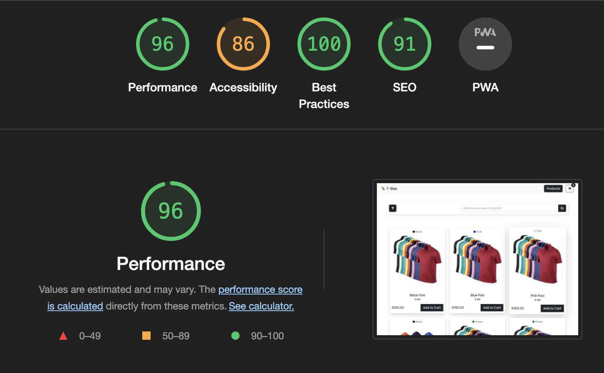

# TeeRex 🦖

This project was bootstrapped with [Create React App](https://github.com/facebook/create-react-app).

## Development

In the project directory, you can run:

```bash
yarn start
yarn build
yarn lint
```

## External Dependencies

1. `bootstrap`. `font-awesome` and `sass`
2. `react-router-dom`
3. `rxjs`

## Score

There is scope to improve performance.

