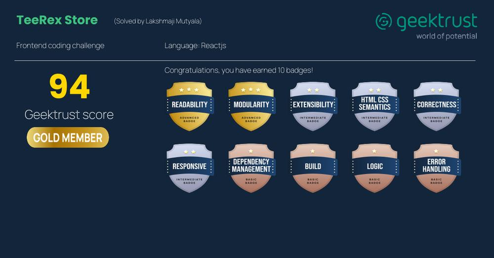

# TeeRex 🦖

[](https://github.com/lakshmaji/tee-rex/actions/workflows/preview.yml)

Live Demo: [here](https://teerex-store.surge.sh/)

## Scores




There is scope to improve performance.

## Development

In the project directory, you can run:

```bash
yarn start
yarn build
yarn lint
yarn test
```

## External Dependencies

1. `bootstrap`. `font-awesome` and `sass`
2. `react-router-dom`
3. `rxjs`
